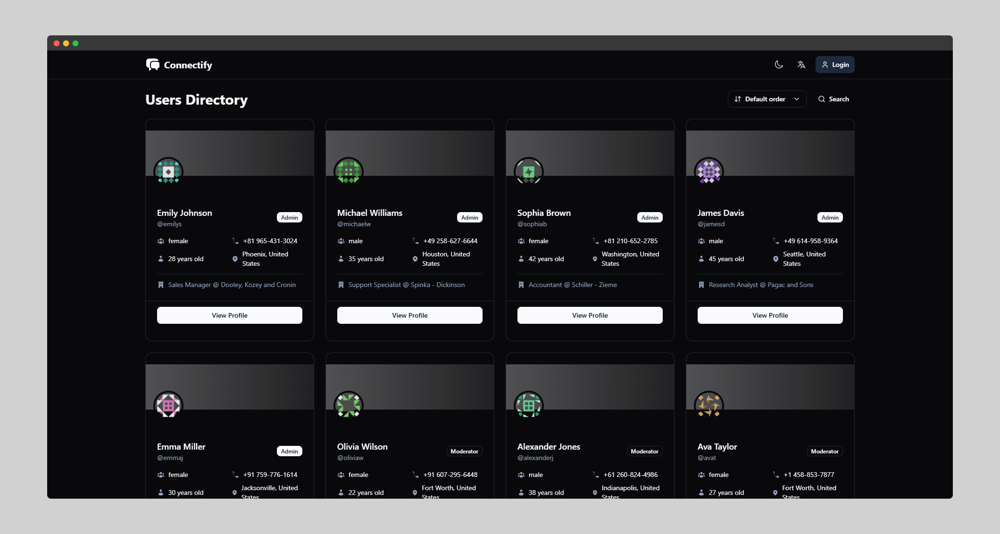

# Connectify - User Directory App



## 📌 Project Overview

A responsive React application that showcases a user directory with detailed profiles and posts. Built as a task for Sourcya, this application demonstrates modern React development practices and advanced frontend techniques.

**🔗 Live Preview:** [View Demo](https://task-mo3bassia-mo3bassias-projects.vercel.app)

## ✨ Features

- **User Authentication**

  - Login functionality with JWT token handling
  - User profile management
  - Persistent sessions using localStorage

- **User Directory**

  - Grid layout of user cards displaying profile information
  - Infinite scroll pagination for improved performance
  - Detailed user profiles with personal information

- **Advanced Data Handling**

  - Real-time search functionality
  - Sorting options (name, age, email, etc.)
  - Filtering by various user attributes (eye color, hair color, country, etc.)

- **Post Management**

  - View posts by specific users
  - Detailed post view with post tags
  - Post metadata and statistics

- **User Experience**
  - Dark/Light theme toggle with persistent preferences
  - Multi-language support (English/Arabic) with RTL handling
  - Responsive design for all device sizes

## 🛠️ Technical Stack

- **Frontend Framework**: React 18 with Vite
- **Routing**: React Router v6
- **API State Management**: TanStack React Query (formerly React Query)
- **UI Components**: ShadcN UI (based on Radix UI)
- **Styling**: Tailwind CSS
- **API**: DummyJSON REST API
- **Internationalization**: i18next
- **HTTP Client**: Native fetch API

## 🔍 Implementation Details

- Created custom hooks based on React Query for data fetching and caching
- Implemented infinite scrolling using Intersection Observer API
- Minimized useEffect usage to prevent unnecessary renders and improve performance
- Built responsive UI components with Tailwind CSS and ShadcN
- Used React Context for theme and language preferences
- Implemented RTL support for Arabic language

## 🚀 Performance Optimizations

- Used React Query for efficient API calls and caching
- Implemented infinite scrolling to reduce initial load time
- Debounced search inputs to prevent excessive API calls
- Optimized component rendering with proper memoization
- Lazy-loaded components and routes for faster initial load

## 🌐 API Integration

Integrated with [DummyJSON](https://dummyjson.com) endpoints:

- `/users` - Fetch user data with pagination, sorting, and filtering
- `/posts` - Retrieve user posts with tags
- `/auth/login` - User authentication

## 📱 Responsive Design

- Mobile-first approach with responsive breakpoints
- Adaptive layout for different screen sizes
- Touch-friendly UI elements

## 🧰 Project Structure

```
src/
├── components/         # Reusable UI components
│   ├── ui/            # ShadcN UI components
│   └── custom/        # Custom application components
├── hooks/             # Custom React hooks
├── locales/           # i18n translation files
├── pages/             # Application pages
├── utils/             # Utility functions
└── main.jsx           # Application entry point
```

## 📋 Development Notes

- Project completed in approximately 10 hours
- First-time experience with i18next, ShadcN UI, and TanStack React Query libraries
- Focus on clean code architecture and maintainability
- Built with modern React patterns (hooks, custom hooks, context)
- Avoided complex state management libraries in favor of React Query

---

This project demonstrates proficiency in modern React development practices with a focus on performance and user experience.
